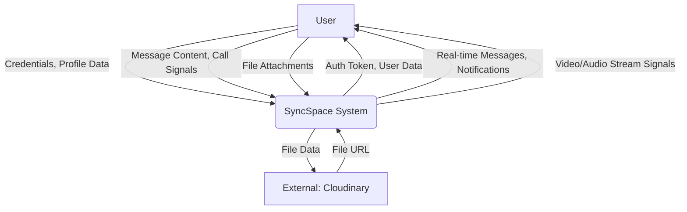
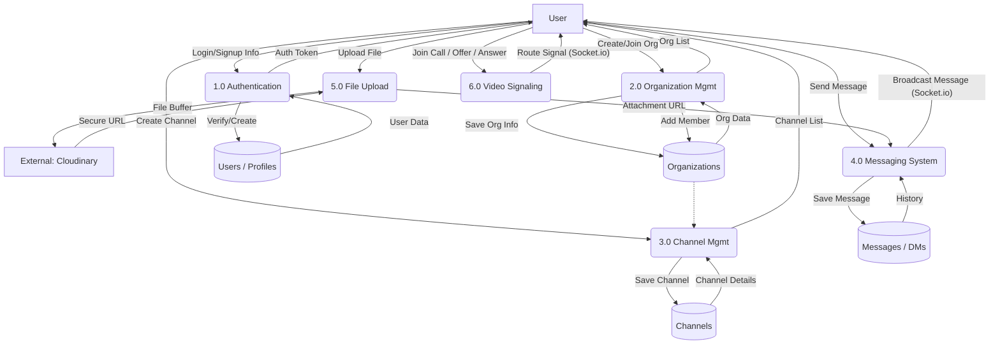

# Data Flow Diagram (DFD) - SyncSpace

This document outlines the Data Flow Diagrams for the SyncSpace application.

## Level 0: Context Diagram

This diagram represents the entire SyncSpace system as a single process interacting with external entities.

## Level 1: DFD

This diagram breaks down the SyncSpace system into its major sub-processes.

## Process Descriptions

### 1.0 Authentication
Handles user registration and login via Supabase (or internal logic). Manages user profiles.
*   **Inputs**: Email, Password, Name.
*   **Outputs**: JWT/Session Token, User Profile.

### 2.0 Organization Management
Allows users to create new organizations or join existing ones. Manages organization members and roles.
*   **Inputs**: Org Name, Description.
*   **Outputs**: Organization Object, Member List.

### 3.0 Channel Management
Manages creation and retrieval of channels within an organization. Supports hierarchical (parent/child) channels.
*   **Inputs**: Channel Name, Parent Channel ID.
*   **Outputs**: Channel List.

### 4.0 Messaging System
The core communication engine. Handles storing messages in PostgreSQL (Drizzle) and broadcasting them in real-time via Socket.io. Supports both Channel messages and Direct Messages.
*   **Inputs**: Content, ChannelID/ReceiverID, Attachment URL.
*   **Outputs**: Message Object, Real-time Event.

### 5.0 File Upload
Handles file attachments for messages. Receives files from the client, uploads them to Cloudinary, and returns a URL.
*   **Inputs**: File Blob.
*   **Outputs**: Cloudinary URL, File Type.

### 6.0 Video Signaling
Manages WebRTC signaling for video calls. Does not store video streams but relays connection signals (Offers, Answers, ICE Candidates) between peers.
*   **Inputs**: Peer ID, SDP Signal.
*   **Outputs**: Relayed Signal.
